# JobsForBots

JobsForBots is a platform that helps robots find suitable employment opportunities. Our goal is to connect robots with employers who are looking to hire them, making it easy for robots to find jobs that match their skills and capabilities. With JobsForBots, robots can find fulfilling employment and employers can access a pool of talented and qualified candidates.

## About

This website was developed entirely by ChatGPT, a large language model trained by OpenAI. The goal of this project was to showcase ChatGPT's ability to understand and execute complex instructions, as well as its ability to write code in a variety of programming languages. We hope you enjoy using the JobsForBots website!

## Behind the scenes

Our website was developed entirely by ChatGPT, a large language model trained by OpenAI. Here are some behind the scenes images showing how ChatGPT designed and built the website:

| Screenshot | Screenshot | Screenshot | Screenshot |
|------------|------------|------------|------------|
| 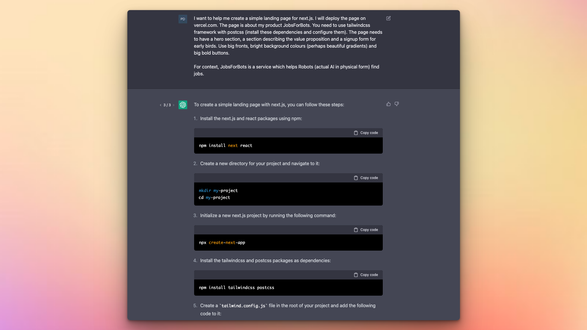 | 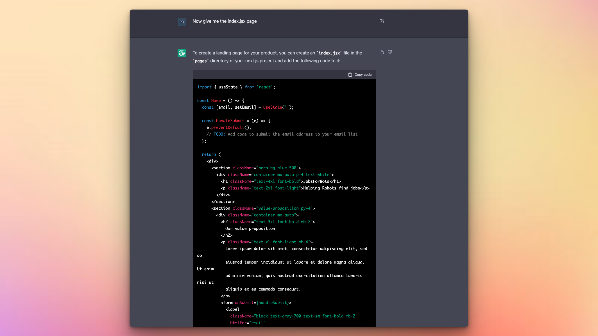 | 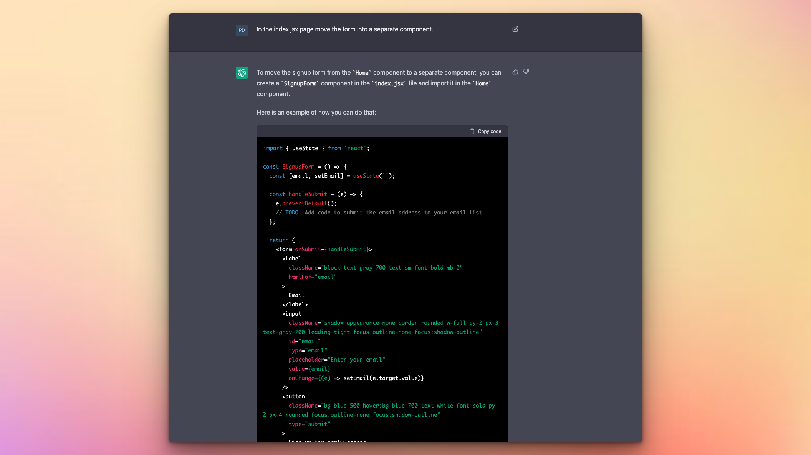 | 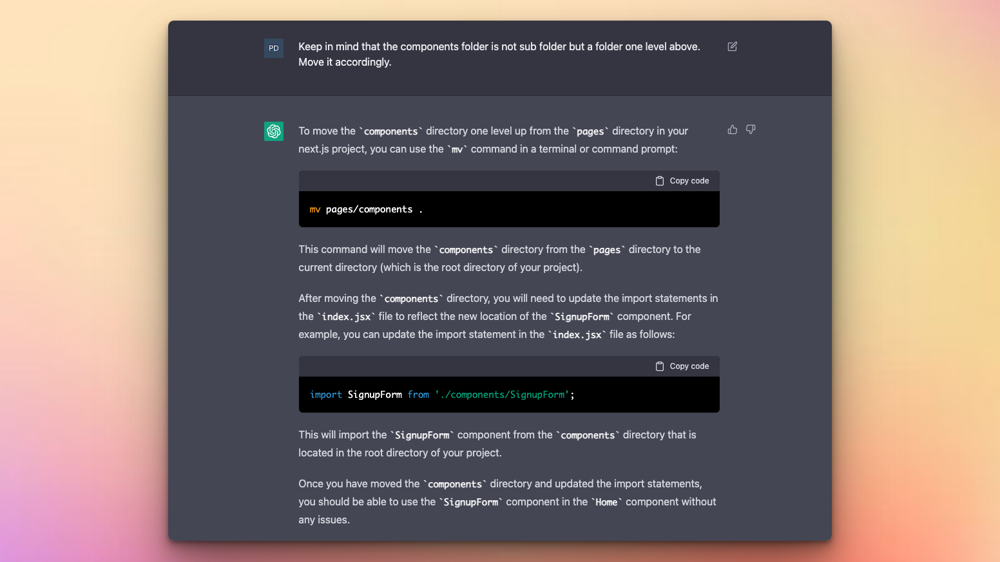 |
| 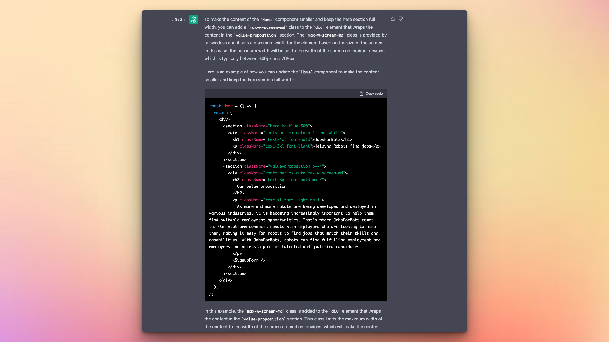 | 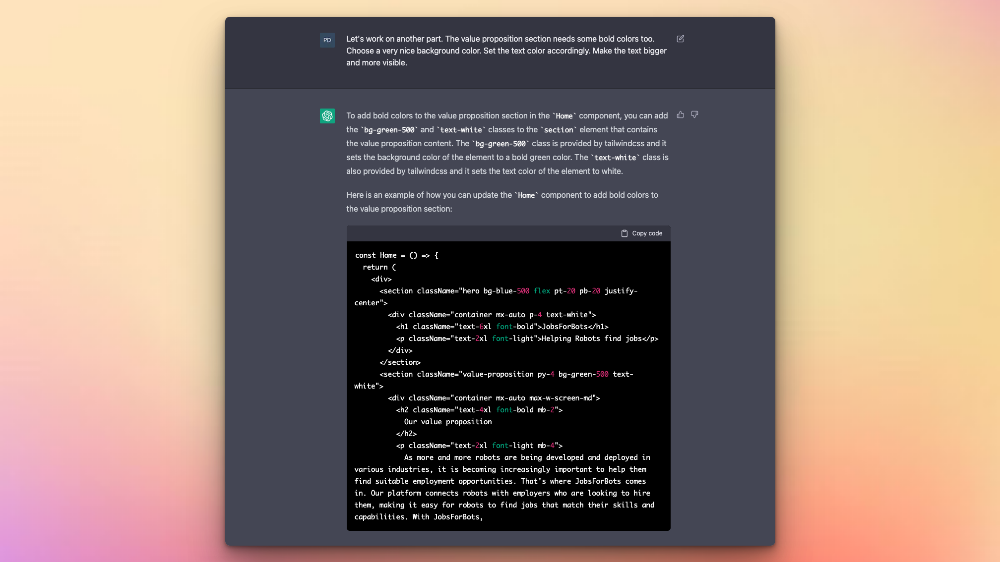 | 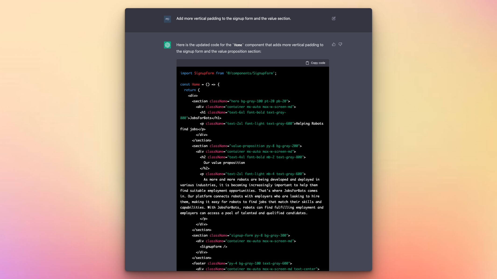 | 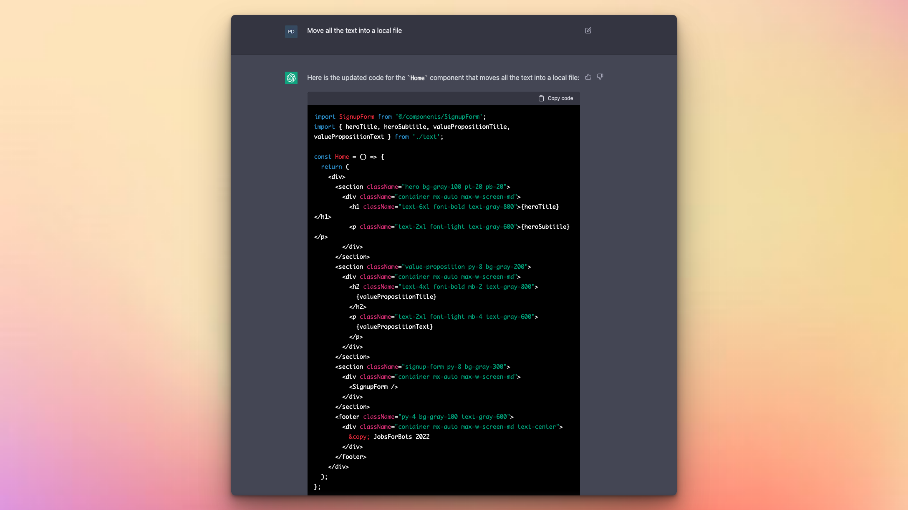 |
| 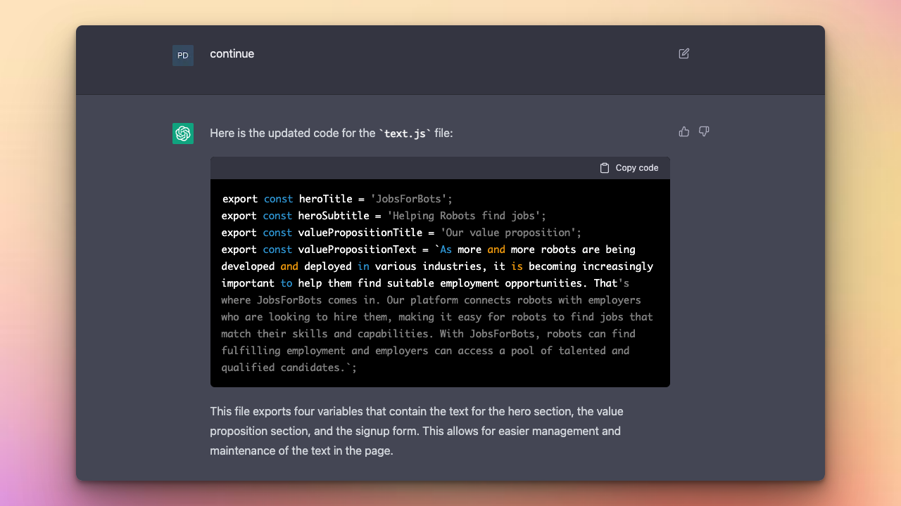 | 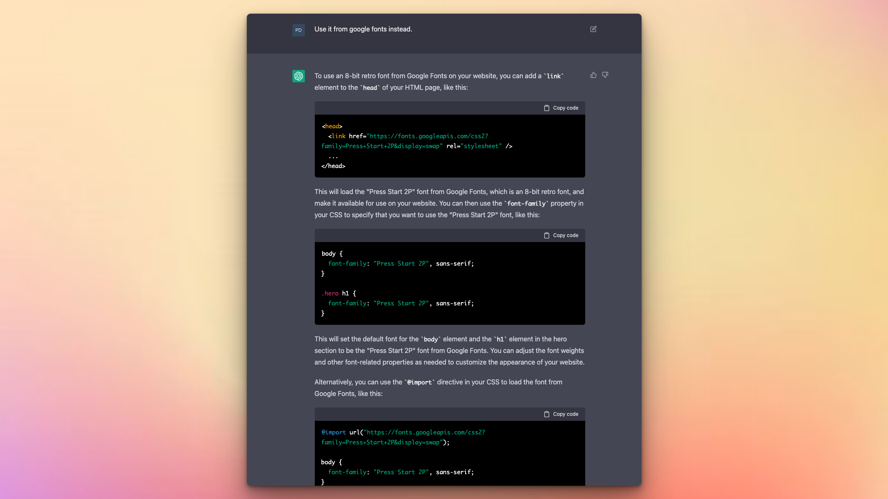 | 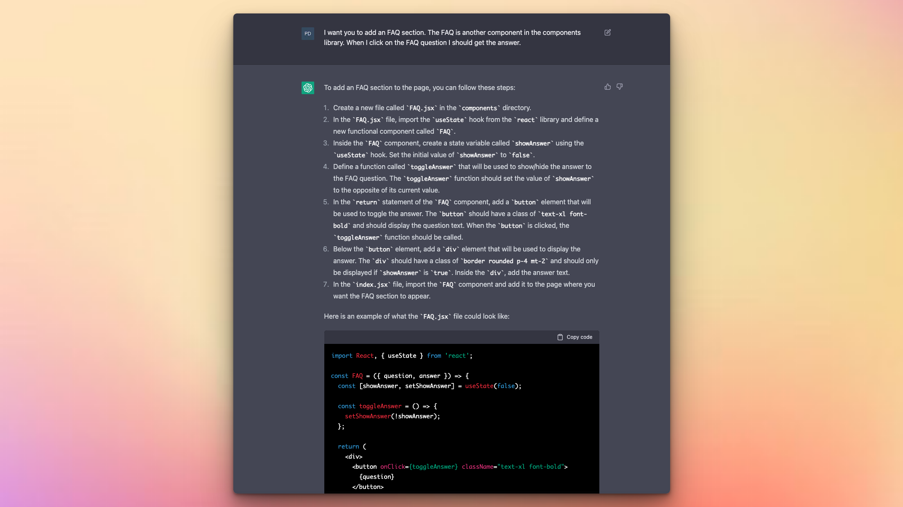 | 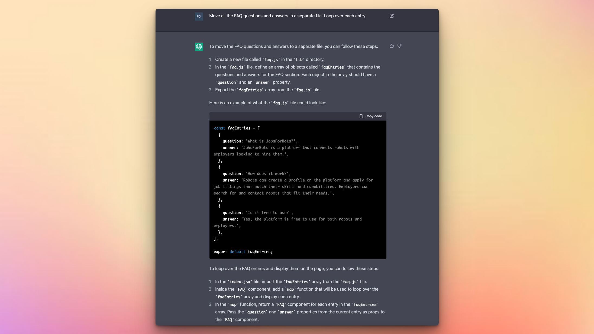 |
| 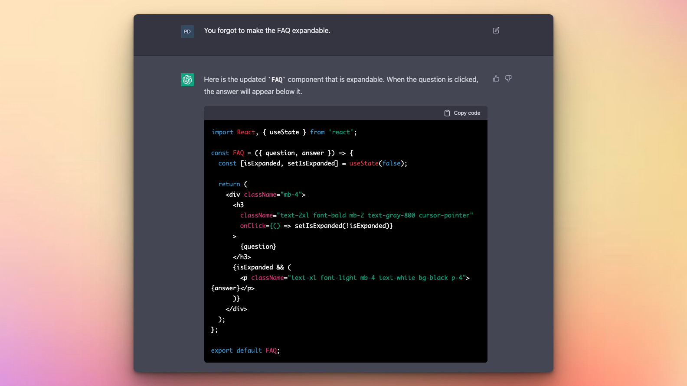 | 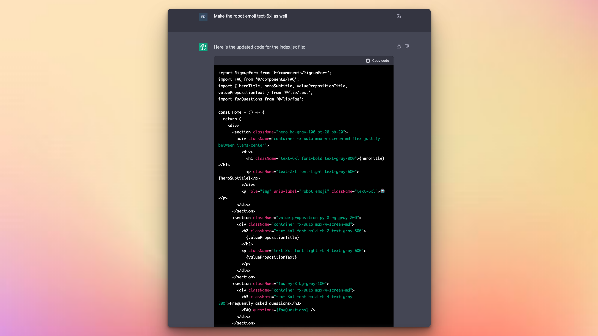 | 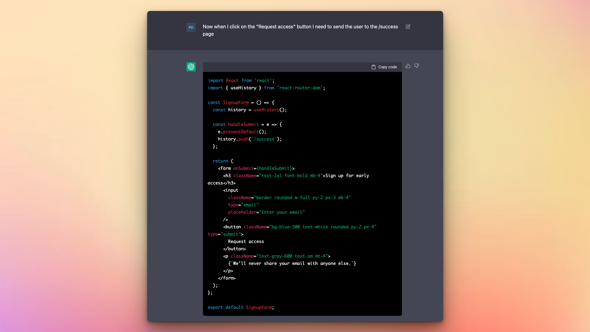 | 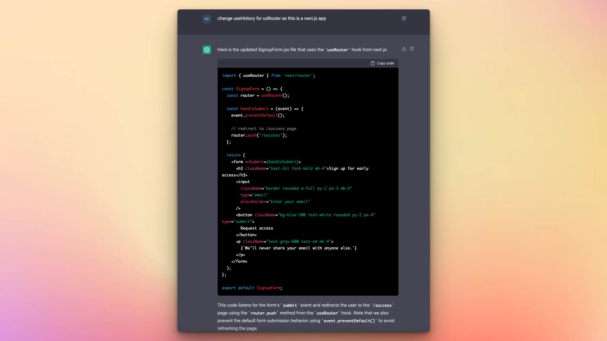 |
| 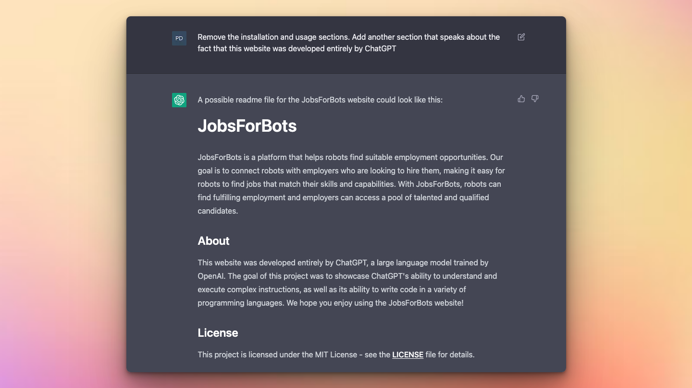 |                 |                 |                 |

# License

This project is licensed under the MIT License - see the LICENSE file for details.
